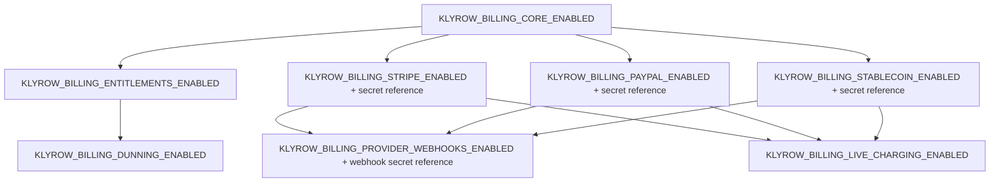

# Billing invariants (Phase 0)

These invariants are documented in Phase 0 and enforced where implementation
already exists. Invariants marked *(future)* apply to Phase 1+ work and are
not yet enforceable because the corresponding code does not exist; Phase 0
still records them so later phases cannot silently violate them.

| Invariant | Enforcement today |
| --- | --- |
| No live charging by default | `KLYROW_BILLING_LIVE_CHARGING_ENABLED` defaults to `false`; `apps/gateway/app/billing_activation.py` blocks gateway startup if it is enabled without a valid, enabled provider. |
| No provider enabled by default | `KLYROW_BILLING_STRIPE_ENABLED`, `KLYROW_BILLING_PAYPAL_ENABLED`, `KLYROW_BILLING_STABLECOIN_ENABLED` all default to `false`. |
| No provider credentials committed to Git | Only `*_SECRET_FILE` / `*_WEBHOOK_SECRET_FILE` path references are configured, never raw secrets; `docs/security/secret-references.json` inventories reference names and source locations only. |
| No plaintext credentials in logs or errors | `billing_activation.py` error messages reference only environment-variable names, never file paths or file content. |
| Tenant isolation is mandatory | Existing `apps/gateway/app/billing.py` models scope every row by `tenant_id`; Phase 0 adds no new billing data model. |
| Money values use integer minor units or an explicitly safe decimal policy | Existing billing models use `Numeric(18,2)`/`Numeric(18,6)`/`Numeric(18,8)` with `Decimal` and `ROUND_HALF_UP` quantization; Phase 0 does not change this. |
| Currency is explicit and validated | Existing `Field(pattern=r"^[A-Z]{3}$")` on catalog/wallet inputs. |
| Idempotency is mandatory for future payment mutations | *(future)* — required for Phase 1 `PaymentAttempt`; existing usage/wallet mutations already use idempotency keys (`event_key`, `reference`) as precedent. |
| Posted accounting records will not be editable or deletable | *(future)* — see `docs/adr/ADR-007-billing-ledger-and-webhook-boundaries.md`. |
| Authorization will be checked server-side | Existing billing routes use `Depends(auth)` / `Depends(require(...))`; Phase 0 does not weaken this. |
| Provider callbacks will not be trusted without verification | *(future)* — enforced by requiring webhook verification-secret references before `KLYROW_BILLING_PROVIDER_WEBHOOKS_ENABLED` can activate, ahead of the receiver existing. |
| Phase boundaries cannot be combined | `docs/adr/ADR-006-billing-ownership-and-provider-boundary.md` requires Phases 0–3 to be independently proposed and merged in order. |

## Fail-closed dependency graph enforced by `validate_billing_activation`

Any attempt to enable a dependent flag without its prerequisite raises
`BillingActivationError`, which the gateway startup hook converts into a
`RuntimeError` that prevents the process from starting.
